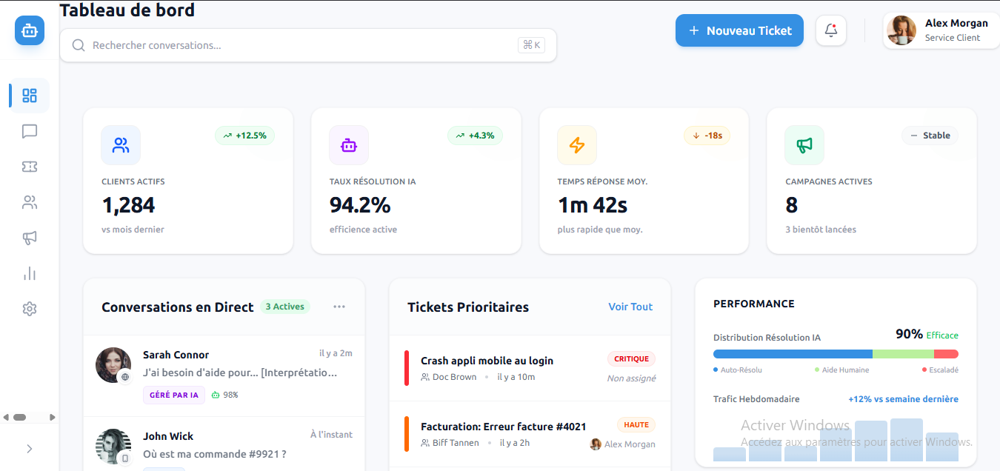
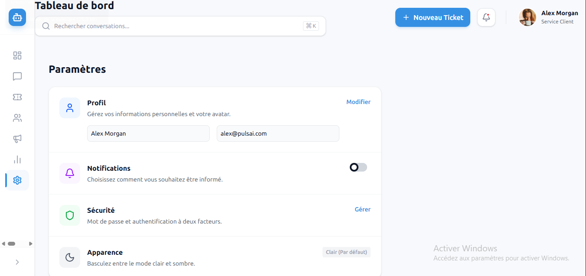

# PulsAI Dashboard

## Description du projet
Ce projet est un Dashboard CRM moderne construit avec Next.js, Tailwind CSS et Framer Motion.

Le design s'inspire des meilleurs standards du marché (Intercom, Linear, Crisp) avec une attention particulière portée aux détails visuels (ombres douces, glassmorphism) et à l'expérience utilisateur (micro-interactions Framer Motion).

## Stack Technique
*   **Framework** : [Next.js 15](https://nextjs.org/) (App Router)
*   **Langage** : JavaScript (React)
*   **Styling** : [Tailwind CSS v4](https://tailwindcss.com/)
*   **Icônes** : [Lucide React](https://lucide.dev/)
*   **Animations** : [Framer Motion](https://www.framer.com/motion/)
*   **Polices** : Ubuntu (Google Fonts)

## Instructions d'installation

Pour lancer le projet localement :

1.  **Cloner le dépôt** :
    ```bash
    git clone https://github.com/votre-user/pulsai-dashboard.git
    cd pulsai-dashboard
    ```

2.  **Installer les dépendances** :
    ```bash
    npm install
    # ou
    yarn install
    ```

3.  **Lancer le serveur de développement** :
    ```bash
    npm run dev
    ```

4.  **Accéder à l'application** :
    Ouvrez [http://localhost:3000](http://localhost:3000) dans votre navigateur.

## Liste des pages implémentées
Toutes les pages sont accessibles via la barre latérale ("Sidebar") :

1.  **Tableau de bord** (`/`) : Vue d'ensemble avec KPI, graphiques et flux d'activité.
2.  **Conversations** (`/conversations`) : Liste des messages avec filtres et indicateurs IA.
3.  **Tickets** (`/tickets`) : Gestion des tickets support avec statuts et priorités.
4.  **Contacts** (`/contacts`) : Annuaire des utilisateurs sous forme de cartes.
5.  **Campagnes** (`/campaigns`) : Suivi des campagnes marketing (taux d'ouverture/clic).
6.  **Analytique** (`/analytics`) : Visualisation des performances (placeholder).
7.  **Paramètres** (`/settings`) : Configuration du profil et des préférences.

## Captures d'écran

### Dashboard Principal

*Vue globale avec Sidebar hybride, KPI Cards et Activité récente.*

### Paramètres

*Configuration du profil, notifications et préférences.*

